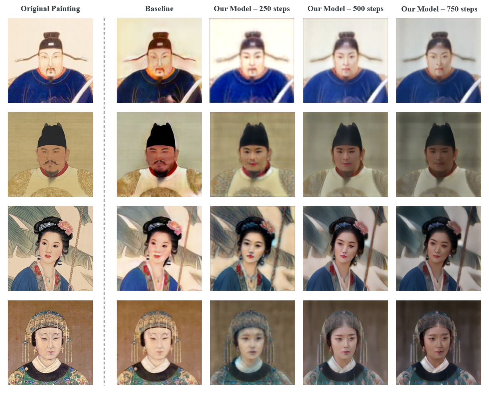

# Art_Reimagined: Bringing Masterpieces to Life
This is a simple Cycle-GAN project trained with custom dataset collected from the internet. The goal of Art_Reimagined is to transform traditional Chinese portrait into real-life images. 

## Introduction
This is a simple Cycle-GAN project which trained with custom dataset collected from the Internet. The idea of this project is to transform traditional chinese portrait painting into real-life photos by utilizing the power of Cycle-GAN.Traditional Chinese paintings are revered for their unique artistic styles and rich cultural heritage. However, translating these traditional artworks into modern presents a significant challenge. In this project the datase are collected specifically from ancient Chinese TV-show to allow the model to capture details of the costumes, hairstyle and feature of faces. 

## Dataset 
The dataset contain Train_A domain and Train_B where the domain A is the Traditional Chinese Portrait Painting collected from Pinterest and the domain B is the photos collected from Chinese TV-shows. We filtered the collected images, croppped out the faces from the images and convert all the images to 256x256 pixels images. The dataset can be found in the input folder.
```
input
    ├── train_photo_input.zip
    └── train_portrait_input.zip
```

1. To generate the dataset required to train the Cycle-GAN model, please run the preprocess/image_transform.py. The generated dataset will be stored in /data directory which can be used to train the Cycle-GAN directly. 
2. To apply image transformation to the dataset, we provide a few option such as jittering, horizontal flip, random crop and rotation. To generate dataset with custom transformation please use the below command. The custom dataset will be stored in the /data directory.
```
python preprocess/image_transform.py --input_dir input --output_dir data/portrait2photo --use_original True --transform_flip True --transform_crop True --transform_jitter True --transform_rotate True
```
## Training
1. The model used is img2img-turbo which is based on Cycle-GAN architecture. The /data folder contain all the necessary files and prompt.txt files required to train the model. For the detailed training of our model please refer to the github link below.

    Reference: https://github.com/GaParmar/img2img-turbo

2. Our model is trained with defaut hyperparameters. The batch size used is 4 and the number of steps is 1500.
    <div>
    <p align="center">
    
    </p>
    </div>

## Evaluation
To evaluate the performance of the model, we provide a few metrics which can be found in the /evaluation folder.

## Checkpoint
To use the model without training, we provided a model checkpoint in the /checkpoint directory which you can download and use it on your own test data.